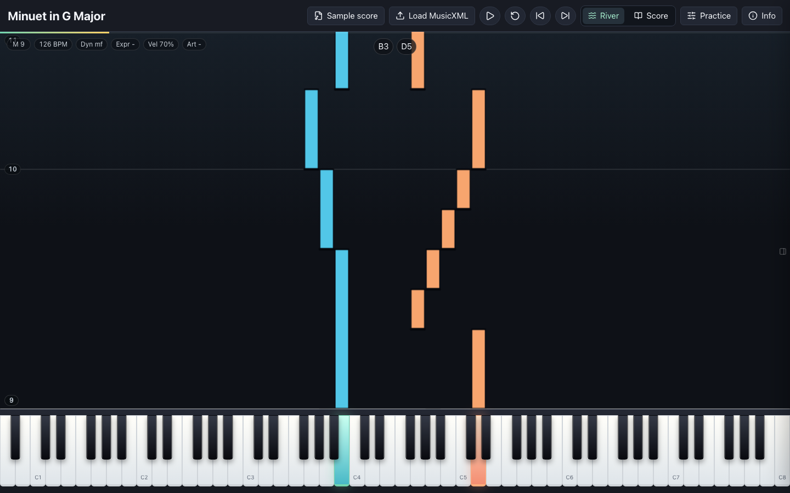

# Clefline

Clefline is a fullscreen browser app for beginner piano practice. It loads
MusicXML, shows a falling-note piano roll, highlights an 88-key keyboard, and can
switch to a notation view rendered by OpenSheetMusicDisplay.



## Commands

```sh
pnpm install
pnpm dev
pnpm check
pnpm build
pnpm test:e2e
```

`pnpm check` runs type checking, oxlint, and unit tests.

## Samples

Only `public/samples/bach-minuet.musicxml` is public and committed. It is
`Bach_Minuet_in_G_Major_BWV_Anh._114.mxl` from the MuseTrainer public domain
MusicXML library, extracted to uncompressed MusicXML. The score file declares
`Public Domain (PianoXML typeset)` in its MusicXML rights metadata.

## License

Code is available under the MIT License. The bundled Bach Minuet sample declares
`Public Domain (PianoXML typeset)` in its MusicXML rights metadata.
